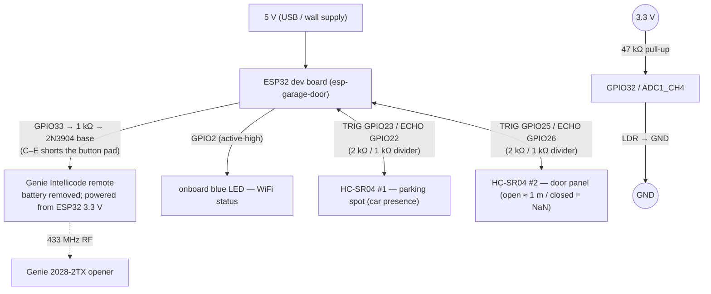

# ESP Garage Door

ESP32 controller for a Genie garage door opener. Triggers the opener through a
transistor-wired spare Intellicode remote — full local control, no myQ cloud,
no Series III wall-console serial protocol. Door state comes from an HC-SR04
aimed at the door panel; a second HC-SR04 watches the parking spot for car
presence.

## Circuit diagram



## Hardware

| Part | Notes |
|------|-------|
| ESP32 dev board | — |
| Genie Intellicode remote (spare) | battery removed; powered from ESP32 3.3 V |
| 2N3904 NPN transistor (TO-92) | shorts the remote's button pad to ground |
| 1 kΩ resistor | GPIO33 → transistor base |
| 2× HC-SR04 ultrasonic (or HC-SR04P 3 V — no divider) | parking + door |
| 2 kΩ + 1 kΩ resistors | ECHO divider per HC-SR04 (skip for HC-SR04P) |
| 47 kΩ resistor + LDR / photoresistor | bulb sensor on GPIO32 ADC |
| Hookup wire | — |

## Wiring

**Door trigger** — GPIO33 → 1 kΩ → 2N3904 base; emitter → GND; collector →
remote button input pad. Remote powered from ESP32 3.3 V + GND (battery out).
2N3904 pinout (TO-92, flat face toward you): **1=E, 2=B, 3=C**.

> Find the button input pad: continuity-probe between the remote's battery "−"
> pad and each button pad. The pad *without* continuity to "−" is the input —
> collector goes there. Sanity-check by briefly jumpering it to "−" with the
> battery in; the door should fire.

**WiFi LED** — GPIO2 (active-high).

**Light sensor (GPIO32 ADC)** — `3.3 V ─[ 47 kΩ ]─┬─ GPIO32`; `└─ LDR ─ GND`.
ESP32 internal pull-ups are bypassed for ADC pins, so the external 47 kΩ
pull-up is mandatory (`pullup: true` is silently ignored).

**HC-SR04 ×2** — each: VCC → 5 V, GND → GND, TRIG → GPIO, ECHO → GPIO through
the 2 kΩ/1 kΩ divider (ECHO is 5 V — never wire it direct).

| Sensor | TRIG | ECHO | Aim |
|--------|------|------|-----|
| Parking / car presence | GPIO23 | GPIO22 | straight down at the spot |
| Door state | GPIO25 | GPIO26 | at the door panel |

The door sensor reads ≈1 m when the panel is in beam (OPEN) and times out to
NaN when the door is closed. The parking sensor reads the distance to the
parked car.

## First flash

1. `pip install esphome` (or use docker below).
2. `cp secrets.yaml.example secrets.yaml`; fill in WiFi and generate keys:
   - `openssl rand -base64 32` → `api_encryption_key`
   - `openssl rand -hex 16` → `ota_password`, `fallback_ap_password`
3. `esphome run esp-garage-door.yaml` over USB. After that, OTA works over WiFi.

### Docker (when the native xtensa toolchain breaks)

```powershell
./scripts/Invoke-EsphomeDocker.ps1                       # compile + flash (prompts USB/OTA)
./scripts/Invoke-EsphomeDocker.ps1 -Command compile       # validate, no flash
./scripts/Invoke-EsphomeDocker.ps1 -Device 192.168.1.74   # OTA direct to IP (no USB/mDNS)
./scripts/Invoke-EsphomeDocker.ps1 -Command logs -Device <IP>
```

`-Device <IP>` is the recommended push method once on WiFi (TCP :3232, no
mDNS). Needs docker + membership in the `docker` group (Linux) or Docker
Desktop (macOS/Windows).

## Home Assistant

ESPHome auto-discovers the device on boot — add it with the
`api_encryption_key`. You get the **Garage Door** cover, both distance sensors,
the car-in-garage and bulb-light binaries, and the tunable numbers.

- **Door state** comes from the door HC-SR04 via the cover lambda — real
  position, not an assumption.
- **Tuning:** open the door, read `Door Distance`, set `Door Open Distance` a
  little above it (default 1.5 m). Set `Car Present Distance` against a parked
  car (default 1.2 m) and `Light Threshold Volts` between your dark/lit ADC
  readings. All persist across reboots.

## CI

GitHub Actions runs `esphome config` + `esphome compile` on push/PR with
throwaway CI secrets.

## Project layout

```
.
├── esp-garage-door.yaml            # ESPHome config
├── secrets.yaml                    # local secrets (gitignored)
├── secrets.yaml.example            # template — committed
├── scripts/Invoke-EsphomeDocker.ps1
├── .github/workflows/ci.yml
└── README.md
```
